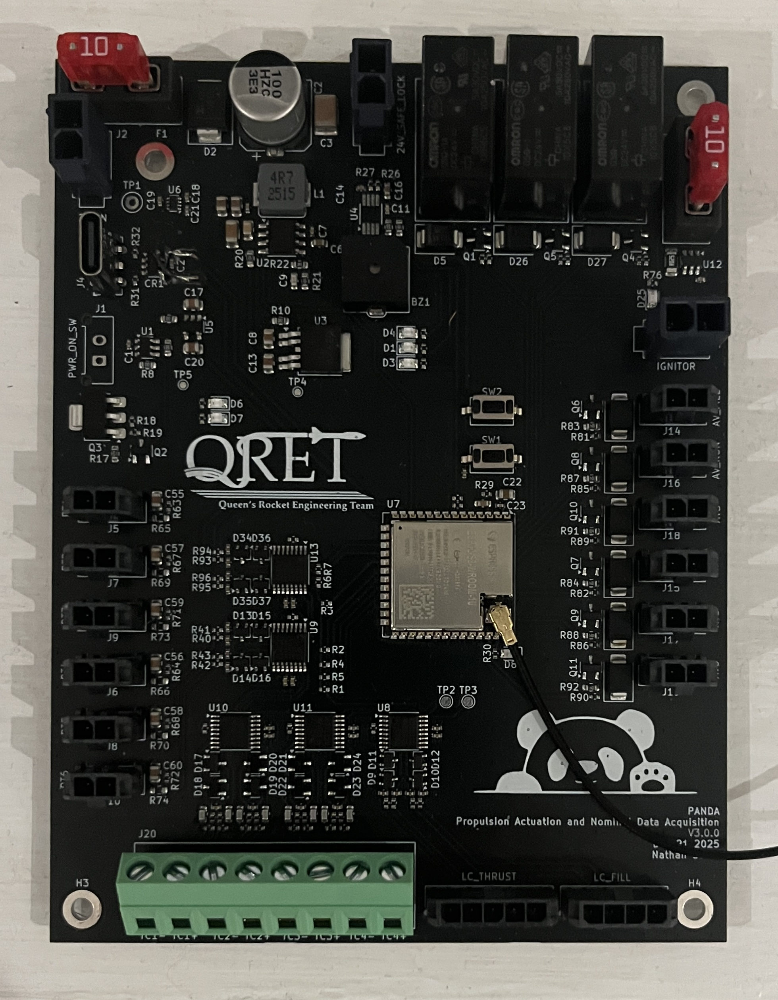
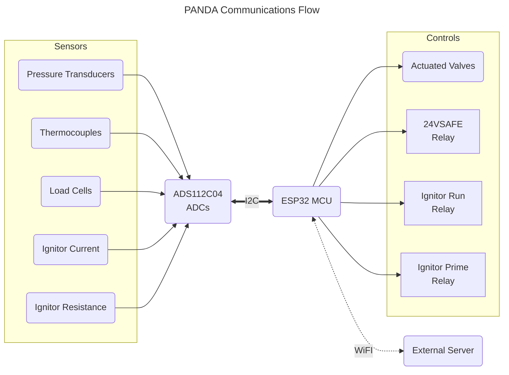
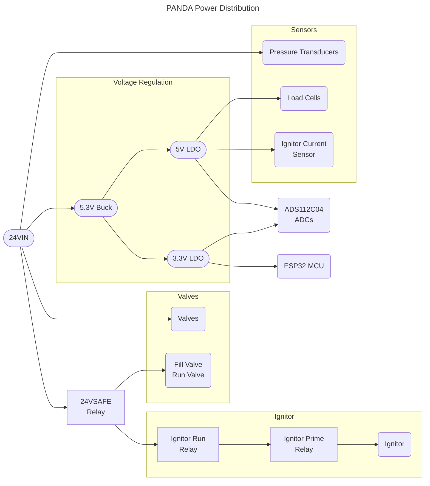

# PANDA Control Board

PANDA (Propulsion Actuation and Nominal Data Acquisition) is the control PCB for the Queen's Rocket Engineering Team hybrid rocket engine. This board actuates valves on the hybrid engine fill panel, controls rocket ignition, and provides pre-launch data acquisition. PANDA is a standalone static fire test stand controller, and provides valve control for ground systems during a launch. PANDA retains ignition control during launch.

## Assembled PCB

## System Architecture

PANDA uses an ESP32S3-WROOM-1U microcontroller for systems control. This ESP32S3 communicates with an external server for streaming sensor readings and remote actuation. All commands are sent from the external server, as PANDA does not autonomously control the fill panel.

Five ADS112C04 ADCs provide sensor readings to the ESP32S3 over an I2C bus. Sensors supported are:

- 6 pressure transducers
- 4 thermocouples
- 2 load cells

Ignitor monitoring is also built into the board. Ignitor current readings are obtained with a current sense amplifier across a shunt resistor in the ignitor path. Ignitor resistance readings are obtained by injecting a current from the ADC's IDAC (current source), and measuring the resulting voltage. A communications diagram for PANDA can be seen below.

PANDA operates from a 24VDC power supply, and has a maximum current rating of 10A. The 24V rail is first stepped down to 5.3V with a switching converter and then dropped to 5V and 3.3V with LDOs. The 5V rail supplies analog systems, and the 3.3V rail supplies digital systems. Using LDOs on the switching output allows for low-noise power for analog measurements.

The 24VSAFE rail is only be energized when the fill panel is vacated, as it powers hazardous components such as the ignitor. The ignitor utilizes two relays in series for additional redundancy, and to ensure ignition is always intentional. A power distribution chart of PANDA can be seen below. This graph does not include the power sequencing and filtering present on the board.

## Required Software
To open the project files, the only required application is KiCad. If manufacturing with JLCPCB, install the Fabrication Toolkit KiCad plugin for JLCPCB.

## Recommended Manufacturing Options
If ordering from JLCPCB, use the JLC04161H-3313 stackup option. For JLCP PCBA, the standard PCBA option is required due to the ESP32S3-WROOM-1U.
